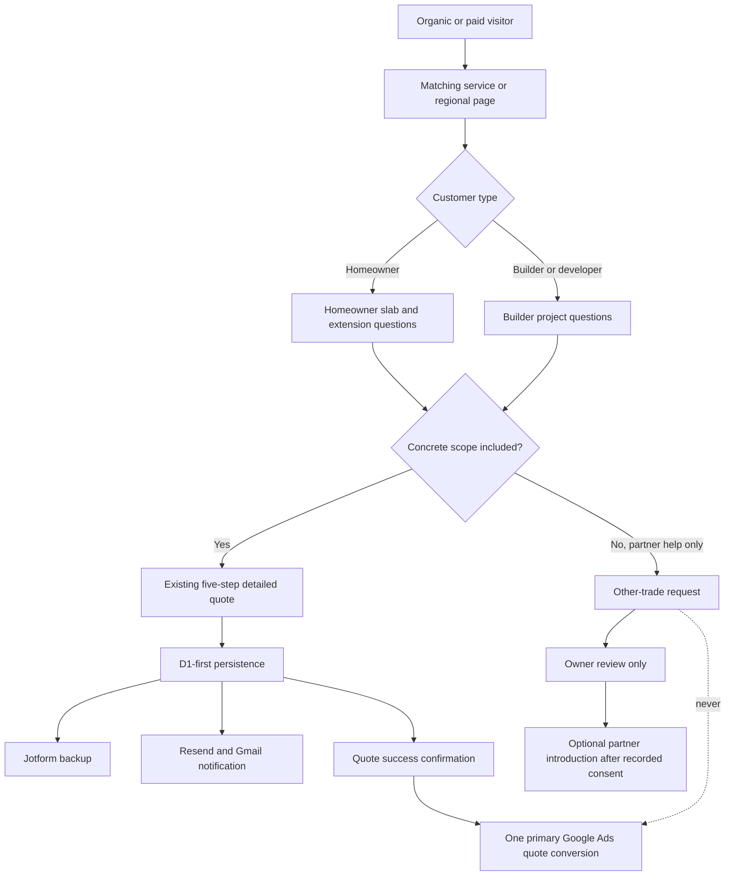

# Regional Slab and Extension Conversion Takeover Design

**Date:** 26 September 2026  
**Author:** Manus AI  
**Status:** Approved design; implementation requires written-spec review  
**Branch:** `feature/regional-slab-takeover-preview`  
**Base:** verified Gold Coast preview branch `5ac6e39b2705b7ffa67a801bc656c381568587fd`

## Decision

Concrete Concepts Group will build a **service-first, region-specific conversion system** for Brisbane, the Ipswich growth corridor, North and Central Gold Coast, and selected Sunshine Coast projects.

The system will prioritise **new-house slabs, extension slabs, footings and directly delivered concrete work**. It will serve homeowners and builders through separate qualification pathways. Customers seeking a complete house extension may request an introduction to a reviewed non-concrete partner, but only after separate, explicit consent.

The first release will be a **Cloudflare noindex preview**. Production, sitemap, Search Console and Google Ads changes remain outside this implementation until the preview receives separate release approval.

At design approval, Cloudflare production was deployment `19ce3c2e-c4a6-44a7-bd8f-86b360e16451` from commit `a640076`. This is a baseline, not a future rollback instruction. Production and rollback deployments must be read again immediately before any approved customer release.

## Why this approach

The production database recorded 72 genuine detailed quotes during the reviewed 90-day period. Twenty-four included slab work. Brisbane and other South East Queensland areas produced 69 detailed quotes, while the Ipswich corridor produced two and the Gold Coast produced one. No Sunshine Coast detailed quote was identified. This proves slab demand but also shows that regional acquisition beyond Brisbane is still underdeveloped.

Long-term growth evidence supports prioritising Ipswich and selected coastal corridors, but population or dwelling projections do not guarantee CCG enquiries. Ipswich Council identifies Ripley, South Ripley, White Rock, Deebing Heights, Spring Mountain and Redbank Plains among current growth areas, while the Ripley Valley Priority Development Area has capacity for substantial future housing.[1] [2] Gold Coast and Sunshine Coast growth signals support controlled tests, not universal service or availability claims.[3] [4]

Google identifies substantially similar regional or city pages that funnel users to one destination as potential doorway abuse.[5] The design therefore uses one substantial hub per justified region, distinct service pages and existing locality pages only where they offer unique value.

## Alternatives considered

### Recommended: service-first regional hubs

This design creates a small number of authoritative pages and sends each visitor into a service- and audience-aware quote path. It supports SEO, paid Search relevance and commercial qualification without manufacturing thin pages.

### Rejected: large suburb-page expansion

Creating separate house-slab and extension pages for every suburb would increase page count quickly, but it would also create duplicated content, weak internal competition and doorway-page risk. Deebing Heights and other growth suburbs will initially be covered inside a substantive Ipswich/Ripley hub rather than through cloned pages.

### Rejected: Ads-only expansion

Widening Search or Performance Max without matching landing pages and qualification would create faster traffic but weaker intent matching. It would also make regional travel, builder requirements, extension scope and partner consent difficult to control.

## Public information architecture

### Brisbane core

The existing `/services/concrete-slabs-brisbane` route will be upgraded rather than replaced. It will become the authoritative Brisbane slab page and cover new-house slabs, foundations, footings, garage and structural residential slabs where CCG directly performs the concrete scope.

A new `/services/extension-slabs-brisbane` page will cover extension slabs, build-under and under-house work, footings and interfaces with existing structures. It will explain that feasibility and final scope depend on the actual plans, engineering, site conditions, approvals and certifier requirements. Brisbane City Council states that extensions and renovations can require building and other approvals, so the page will provide general readiness guidance rather than project-specific advice.[6]

A new `/guides/how-house-slab-quotes-work` resource will explain what CCG needs before issuing a site-specific quote. A separate `/guides/extension-slab-readiness` resource will explain drawings, engineering, access, services and approval status in plain language.

### Ipswich growth corridor

A new `/areas/ipswich-ripley-house-slabs` hub will cover CCG’s direct slab and extension-slab service across:

- Ipswich
- Ripley and South Ripley
- Deebing Heights
- White Rock
- Springfield, Springfield Central and Springfield Lakes
- Spring Mountain
- Redbank Plains

The existing Ipswich, Ripley, South Ripley, White Rock and Springfield routes will remain intact. The hub will link to useful existing pages without creating duplicate service-and-suburb combinations. Deebing Heights will begin as a substantial hub section, not a thin standalone page.

The hub will distinguish new-house slab demand in the Ripley Valley growth corridor from extension-slab demand in established Ipswich and Springfield locations. It will state only the coverage that CCG can genuinely quote and service.

### North and Central Gold Coast

The implementation will extend the verified Gold Coast preview rather than rebuild it. The existing preview routes will remain:

- `/areas/gold-coast`
- `/gold-coast/driveways`
- `/gold-coast/exposed-aggregate`
- `/gold-coast/patios-paths-pool-surrounds`
- `/gold-coast/shed-garage-patio-slabs`
- `/gold-coast/small-retaining-walls`

Two distinct structural pages will be added:

- `/gold-coast/house-slabs`
- `/gold-coast/extension-slabs`

The hub will prioritise Ormeau, Pimpama, Coomera and Upper Coomera, followed by Helensvale, Oxenford, Pacific Pines and selected central locations. Existing locality pages will be linked where useful. No new suburb-page farm will be created.

### Selected Sunshine Coast projects

A new `/areas/sunshine-coast` hub will present CCG as a **Brisbane-based team accepting selected, scheduled Sunshine Coast projects**. It will not claim a local depot, universal availability or immediate response.

Initial coverage will focus on:

- Aura and Caloundra South
- Banya and Nirimba
- Palmview and Harmony
- Sippy Downs
- selected nearby southern and central Sunshine Coast locations by address review

The page will focus on house slabs, shed and garage slabs, patios and other directly performed concrete work. Travel, access, project size, plans and scheduling will be qualified before a quote is accepted. The Caloundra South Priority Development Area and Sunshine Coast projections support testing this market, but do not prove CCG demand or availability.[4] [7]

### Other surrounding areas

Moreton Bay, Logan and Redland will remain visible through the existing service-area hierarchy and truthful coverage statements. They will not receive new regional hubs in this preview. A later hub requires evidence of service capacity, qualified demand, first-hand content and a commercially viable travel or mobilisation model. Any short-term paid test for these areas must use the most relevant existing service page and a separate approval.

## Quote-path design

The current five-step quote funnel remains the only primary customer quote workflow. Its Australian contact validation, location qualification, anti-spam controls, local draft, photo protection, D1-first persistence, Jotform backup, Resend/Gmail notification, success confirmation and transaction-id deduplication must remain unchanged unless a specific contract test approves a change.

### First decision: customer type

The job-brief step will ask whether the enquiry is from:

- a homeowner or property owner; or
- a builder, developer or construction company.

This choice changes only the relevant qualification questions. It does not bypass required contact, location, consent or anti-spam controls.

### Homeowner pathway

The homeowner pathway will collect:

- new house, house extension, under-house/build-under or other concrete project;
- approximate dimensions or an explicit “not sure” choice;
- plans, engineering or soil/foundation information if available;
- approval or certifier status, including “not sure”;
- site and pump-access notes;
- desired start window; and
- optional photos or drawings.

Unknown documents will not block enquiry submission. The success message will say that CCG will review the supplied project information before confirming scope, availability or price.

### Builder and developer pathway

The builder pathway will collect company name and role, project address, project type, number of sites or pours, documents available, required concrete scope, indicative programme and preferred follow-up. It will use the same secure backend delivery and will not publish private builder contact information anywhere on the website.

The builder pathway remains a detailed quote. It may count as the primary Google Ads conversion only after successful D1-backed submission through the existing endpoint.

### Complete-extension pathway

An extension enquiry must include a concrete component to remain in the detailed CCG quote flow. The page and form will state that CCG directly quotes and performs its concrete scope.

The customer may separately select an unticked option:

> I would like CCG to introduce me to a reviewed partner for non-concrete extension work.

This selection records consent but does not forward the enquiry automatically. Before any disclosure, CCG must identify the intended partner, explain the partner’s role and what information will be shared, and obtain the applicable final consent. CCG reviews the request first. The partner contracts separately unless a later verified commercial arrangement states otherwise.

If an enquiry requests only non-concrete extension work, it will use the existing other-trade pathway. It will stay secondary and non-biddable. It must never create a primary Quote Form Submission conversion.

## Lead and conversion data flow

A completed detailed quote remains the only primary Google Ads bidding action. Calls, text-message clicks, WhatsApp, callbacks, guide downloads, quote starts, document uploads, partner requests and page interactions remain secondary or non-conversion events.

## Page-level conversion design

Every new or upgraded page will use one clear primary action: **Request a site-specific concrete quote**. Secondary phone or message controls may remain available but must not visually compete with the detailed quote on high-intent slab pages.

The hero will state the service, geographic boundary and CCG’s direct scope. The next section will explain suitable projects. A short “what we need to quote” checklist will reduce uncertainty before the visitor opens the funnel. Approval, engineering and certification information will be general and linked to authoritative sources.[6] [8]

Trust content must be evidence-backed. No page may publish unverified licence, insurance, engineering, Australian Standards, price, timing, guarantee, review, experience, local-team or availability claims. The exact QBCC contractor name, licence number and class may be used only after current verification. The Australian Competition and Consumer Commission requires advertising claims to be truthful and capable of substantiation.[9]

Written quotes and contracts must clearly separate CCG’s concrete inclusions, exclusions, assumptions, client-supplied documents, approvals, third-party work and variations. The applicable Queensland domestic-building contract requirements must be checked against the actual job value and scope.[10]

## SEO safeguards

The regional hub hierarchy will be browseable from the service-area page and relevant core service pages. Each indexable page must have a unique title, description, canonical URL, H1, visible content, breadcrumbs, internal links and appropriate Service and FAQ schema.

The preview build must return `X-Robots-Tag: noindex, nofollow` on every non-customer host. Preview routes must not enter the customer sitemap. Customer hosts must continue to return not-found behaviour for routes that are not yet published.

The production build flag stays off by default. Future publication requires a separate approved flag transition, sitemap update, Search Console submission and verification that no preview marker or noindex directive reaches the customer host.

The design will not create mass service-by-suburb permutations. A new locality page is permitted only when it has unique customer value, truthful operating coverage and first-hand evidence beyond a suburb name.

The writing standard is people-first usefulness rather than keyword coverage. Pages must demonstrate direct knowledge of CCG’s process and must not be produced principally to attract search visits.[11]

## Google Ads design after publication

No Google Ads mutation is part of the preview implementation.

After production approval, Search campaigns should own the structural intent through non-overlapping groups:

- Brisbane house and new-home slabs;
- Brisbane extension slabs, build-under work and footings;
- Ipswich and Ripley Valley house slabs;
- Ipswich and Springfield extension slabs;
- North and Central Gold Coast house and extension slabs;
- selected Sunshine Coast scheduled slab projects; and
- builder and developer slab enquiries.

Each group must use its matching landing page. Campaign location settings must use presence targeting. Region exclusions and reciprocal negatives must prevent Brisbane, Ipswich, Gold Coast and Sunshine Coast groups from competing for the same query.

Initial keyword tests should favour exact and phrase forms of house slab, concrete slab contractor, extension slab, footings and location-qualified variations. Repair, DIY, material-only, job-seeker, training and engineering-only searches should not enter acquisition groups unless CCG deliberately offers that service.

Any budget-neutral reallocation between Search and Performance Max requires a separate Ads approval. It should be based on qualified cost per opportunity, quote rate, win rate and gross margin—not clicks or raw platform conversions.

## Measurement model

Every detailed quote will retain or add structured fields for:

- audience type;
- region and suburb;
- project type;
- new-build versus extension;
- service requested;
- document availability;
- approval or certifier status;
- access complexity;
- partner-introduction consent;
- source, campaign, ad group and landing route; and
- D1 quote and transaction identifiers.

The operational funnel is:

> detailed quote → contactable → qualified concrete opportunity → document or site review → written quote → accepted work → completed job

Reporting will show lead volume, qualified rate, cost per qualified opportunity, quote rate, win rate, value, gross margin and travel or mobilisation burden by region and service. Customer-identifying data must not enter marketing dashboards.

## Error handling and safety

If D1 persistence fails, the submission must fail safely rather than claim success. Jotform and Resend/Gmail errors must be recorded for reconciliation while preserving the D1 source of truth. Duplicate transaction IDs must not generate duplicate owner notifications or duplicate Ads conversions.

If the location falls outside confirmed coverage, the form will not promise service. It may offer manual address review. Sunshine Coast enquiries may be held for route and schedule confirmation.

If partner consent is absent, no non-concrete provider data transfer may occur. If a customer later withdraws consent before disclosure, the partner step must stop without affecting CCG’s concrete quote.

## Test and acceptance requirements

The implementation must be test-first and cover:

1. every new route under preview-on and production-off builds;
2. preview-wide noindex and customer-host isolation;
3. unique metadata, canonicals, breadcrumbs, schema and sitemap exclusion;
4. all regional links and malformed-route 404 behaviour;
5. homeowner and builder conditional questions;
6. local draft preservation and service/region prefill;
7. complete-extension consent defaulting to unchecked;
8. no provider forwarding without final consent and owner review;
9. D1/Jotform/Resend/Gmail payload compatibility;
10. exactly one primary conversion after confirmed detailed-quote success;
11. zero primary conversions for other-trade or partner-only requests;
12. Australian phone and service-area validation;
13. private-photo token and no-store protections;
14. mobile and desktop keyboard accessibility;
15. no horizontal overflow, runtime errors or broken links; and
16. ordinary production build parity with all new publication flags off.

The final noindex Cloudflare preview must use isolated preview D1 and R2 resources plus dry-run delivery settings. No real lead, customer email, Jotform record or Google Ads conversion may be created during acceptance testing.

## Release boundaries

### Included in the approved preview build

- Brisbane slab-page upgrade
- Brisbane extension-slab page
- two quote-readiness guides
- Ipswich/Ripley/Deebing Heights regional hub
- Gold Coast house-slab and extension-slab additions
- selected Sunshine Coast hub
- homeowner and builder qualification paths
- concrete-plus-optional-partner extension path
- preview-only SEO and routing
- structured measurement fields and contract tests

### Explicitly excluded

- customer production deployment
- sitemap or Search Console submission
- Google Ads keywords, negatives, budgets, bids, locations, goals, assets or final URLs
- automatic provider forwarding
- publishing partner identities before verification
- unverified licences, insurance, reviews, project photos, prices or performance claims
- mass suburb or service-by-suburb pages
- a complete-extension claim by CCG
- changes to the existing primary-conversion isolation

## Rollout after preview approval

The first production release should publish the Brisbane slab upgrade, Brisbane extension page and Ipswich/Ripley hub. Gold Coast should follow as a separate controlled release from the already verified preview. Sunshine Coast should follow only after direct-service scheduling and mobilisation rules are confirmed.

Ads changes should begin only after the matching landing pages are live and pass passive production validation. Search should be tested before broad automated expansion. Each region should be judged on qualified and won work over a mature 60–90-day cohort.

## Success criteria

The system succeeds when it produces more **qualified, directly serviceable and profitable opportunities**, not merely more clicks or form starts. The minimum success measures are:

- every detailed quote is persisted and reconciled downstream;
- every lead is classified by region, audience and project type;
- no partner details are shared without recorded consent;
- no preview URL receives paid or organic customer traffic;
- each published region has a distinct, useful landing page;
- structural slab enquiries increase without weakening qualification;
- qualified cost per opportunity and quote-to-win rate improve or remain within the owner’s written commercial cap; and
- service capacity and response times remain acceptable as volume grows.

## References

[1]: https://www.ipswich.qld.gov.au/News-Articles-Folder/2026/Queenslands-fastest-growing-city-surpasses-270000-residents "Ipswich City Council — Queensland’s fastest growing city surpasses 270,000 residents"
[2]: https://www.edq.qld.gov.au/projects/ripley-valley/ "Economic Development Queensland — Ripley Valley Priority Development Area"
[3]: https://www.qgso.qld.gov.au/issues/3061/population-growth-highlights-trends-qld-regions-2024-edn.pdf "Queensland Government Statistician’s Office — Population growth highlights and trends"
[4]: https://www.sunshinecoast.qld.gov.au/experience-sunshine-coast/statistics-and-maps/population-forecast "Sunshine Coast Council — Projected population and dwellings"
[5]: https://developers.google.com/search/docs/essentials/spam-policies "Google Search Central — Spam policies"
[6]: https://www.brisbane.qld.gov.au/building-and-planning/getting-started-on-your-project/residential-projects/extensions--raising-or-renovations "Brisbane City Council — Extensions, raising or renovations"
[7]: https://www.edq.qld.gov.au/projects/caloundra-south/ "Economic Development Queensland — Caloundra South Priority Development Area"
[8]: https://www.qbcc.qld.gov.au/home-owner-hub/build-renovate/doing-work/building-approvals-certification "Queensland Building and Construction Commission — Building approvals and certification"
[9]: https://www.accc.gov.au/consumers/advertising-and-promotions/false-or-misleading-claims "Australian Competition and Consumer Commission — False or misleading claims"
[10]: https://www.qbcc.qld.gov.au/running-your-business/contracts/domestic-building-contracts "Queensland Building and Construction Commission — Domestic building contracts"
[11]: https://developers.google.com/search/docs/fundamentals/creating-helpful-content "Google Search Central — Creating helpful, reliable, people-first content"
